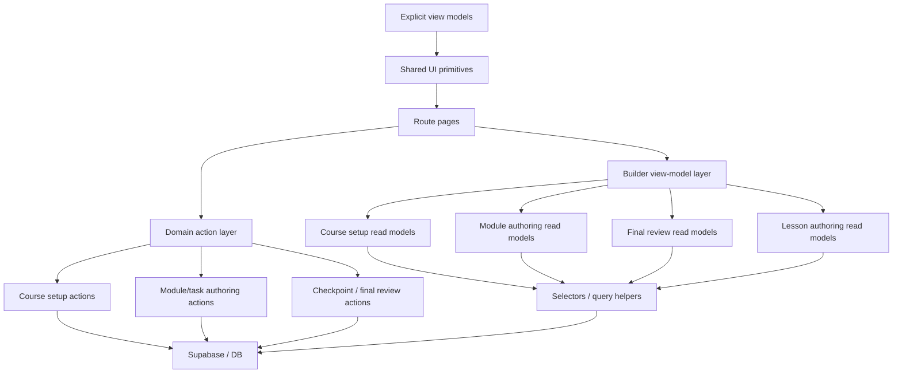

# Course Builder Slice 11 Implementation Plan

## Purpose

This document is the completed implementation record for the post-Slice-10 course-builder track.

It exists to:
- record how the approved Slice `11` direction was implemented
- capture the combined UX improvement and code-reduction architecture work that landed
- preserve the closed builder sequence before later post-Slice-11 follow-on passes

Use this with:
- [docs/implementation/completed/course-builder-unification-plan.md](/Users/katiesanderson/Documents/Scarletts%20Spells/scarletts-spells/docs/implementation/completed/course-builder-unification-plan.md:1)
- [docs/contracts/course-builder-contract.md](/Users/katiesanderson/Documents/Scarletts%20Spells/scarletts-spells/docs/contracts/course-builder-contract.md:1)
- [docs/architecture/course-builder-unification-architecture.md](/Users/katiesanderson/Documents/Scarletts%20Spells/scarletts-spells/docs/architecture/course-builder-unification-architecture.md:1)
- [docs/product/ux-standards.md](/Users/katiesanderson/Documents/Scarletts%20Spells/scarletts-spells/docs/product/ux-standards.md:1)
- [docs/product/ux-decision-register.md](/Users/katiesanderson/Documents/Scarletts%20Spells/scarletts-spells/docs/product/ux-decision-register.md:1)
- [docs/product/areas/course-builder-ux.md](/Users/katiesanderson/Documents/Scarletts%20Spells/scarletts-spells/docs/product/areas/course-builder-ux.md:1)

## Status

- Complete
- Created on 8 May 2026
- Closed on 10 May 2026 after final manual QA passed
- Current relevance: completed implementation record for Slice `11`

## Why Slice 11 Exists

Slice `10` closed the post-pilot remediation work. It did not solve the larger builder architecture problem.

The next job is not cosmetic cleanup.

The next job is to make the course builder:
- easier to author in
- easier to reason about
- able to scale to larger courses
- able to run on significantly less code

## Main oversized and duplicated targets

These are the primary code-reduction targets for Slice `11`:

- [app/courses/[courseId]/page.tsx](/Users/katiesanderson/Documents/Scarletts%20Spells/scarletts-spells/app/courses/%5BcourseId%5D/page.tsx:1)
  - oversized builder composition page
  - mixes setup, task authoring, checkpoint work, review summaries, and structure-specific branching
- [app/courses/actions.ts](/Users/katiesanderson/Documents/Scarletts%20Spells/scarletts-spells/app/courses/actions.ts:1)
  - oversized action surface
  - too many unrelated mutations owned in one place
- [components/structured-lesson-builder.tsx](/Users/katiesanderson/Documents/Scarletts%20Spells/scarletts-spells/components/structured-lesson-builder.tsx:1)
  - powerful but too card-heavy and internally dense
- module/task authoring shells
  - duplicated framing and orchestration across:
    - [app/courses/[courseId]/modules/[moduleId]/page.tsx](/Users/katiesanderson/Documents/Scarletts%20Spells/scarletts-spells/app/courses/%5BcourseId%5D/modules/%5BmoduleId%5D/page.tsx:1)
    - [app/courses/[courseId]/modules/[moduleId]/tasks/[taskId]/edit/page.tsx](/Users/katiesanderson/Documents/Scarletts%20Spells/scarletts-spells/app/courses/%5BcourseId%5D/modules/%5BmoduleId%5D/tasks/%5BtaskId%5D/edit/page.tsx:1)
    - [components/shared-task-creator-form.tsx](/Users/katiesanderson/Documents/Scarletts%20Spells/scarletts-spells/components/shared-task-creator-form.tsx:1)

## Slice 11 design rule

Every Slice `11` pass must pursue both:
- better UX
- less code

No Slice `11` pass may introduce a new parallel builder pattern when an existing one can be generalized instead.

Preferred simplification strategies:
- shared builder shells over page-local wrappers
- shared stage-specific primitives over repeated JSX branches
- smaller domain action modules over one growing action file
- conditional reveal over duplicated form variants
- shared summary/read models over bespoke page-local rendering logic

## Architecture target



### Ownership model

- route pages are orchestrators only
- route pages must not own:
  - detailed row rendering
  - readiness derivation
  - blocker derivation
  - summary formatting
- shared components should consume explicit surface view models where possible, not raw page/domain objects
- large unrelated prop bundles are a failure condition
- if an extracted component needs many unrelated props, create:
  - a read model
  - or a sub-boundary
- action ownership must be split by domain, not by file size alone

## Baseline complexity metrics

| Target file / boundary | Current issue | Required outcome | Metric of success |
|---|---|---|---|
| [app/courses/[courseId]/page.tsx](/Users/katiesanderson/Documents/Scarletts%20Spells/scarletts-spells/app/courses/%5BcourseId%5D/page.tsx:1) | `3026` lines; mixes setup, task authoring, checkpoints, final review, and structure branching | reduce to a stage orchestrator backed by shared read models | route page no longer derives readiness/blockers inline; major stage truth moves behind view-model boundaries |
| [app/courses/actions.ts](/Users/katiesanderson/Documents/Scarletts%20Spells/scarletts-spells/app/courses/actions.ts:1) | `3623` lines; still practical owner of unrelated mutations | split into domain-owned action modules | module/task authoring mutations have a dedicated owner; file is no longer practical owner of all course mutations |
| [components/structured-lesson-builder.tsx](/Users/katiesanderson/Documents/Scarletts%20Spells/scarletts-spells/components/structured-lesson-builder.tsx:1) | `1394` lines; dense internal ownership and card layering | flatten ownership, not just visuals | repeated card wrappers and mixed responsibilities are materially reduced |
| [app/courses/[courseId]/modules/[moduleId]/page.tsx](/Users/katiesanderson/Documents/Scarletts%20Spells/scarletts-spells/app/courses/%5BcourseId%5D/modules/%5BmoduleId%5D/page.tsx:1) | `986` lines; owns row rendering, inline edits, task summaries, and focus-block orchestration | become a module-stage orchestrator with shared row/view-model boundaries | task rows and focus-block rows stop being rendered from raw inline page branches |
| `final review` inside [app/courses/[courseId]/page.tsx](/Users/katiesanderson/Documents/Scarletts%20Spells/scarletts-spells/app/courses/%5BcourseId%5D/page.tsx:1) | readiness, blockers, checkpoints, and review summaries still derived inline | extract canonical final-review read model | final review stays usable on the large synthetic fixture and is no longer an ungrouped wall of sections |
| focus-block row boundary | large prop bundle in [components/focus-block-module-row.tsx](/Users/katiesanderson/Documents/Scarletts%20Spells/scarletts-spells/components/focus-block-module-row.tsx:1) | replace prop soup with explicit focus-block row model | extracted component no longer requires a broad unrelated prop chain |

## Hard migration stance

The app is not live yet.

Slice `11` should therefore be treated as a hard cleanup migration:
- prefer one clean ownership model over temporary compatibility layers
- delete duplicated patterns instead of preserving them for comfort
- do not keep bad boundaries because they currently work
- preserve semantic truth only:
  - reward
  - review
  - completion
  - visibility
  - timed/progress discipline

## Synthetic large-course fixture requirement

Slice `11` requires one canonical large-course fixture generator that supports both:
- automated QA
- local seeded manual QA

Required fixture shape:
- approximately `20` phases
- approximately `100` modules
- approximately `500` tasks
- mixed readiness states
- blockers
- focus blocks
- structured lessons
- recurring tasks
- hidden/paused items

The fixture must be generated through a reusable factory plus seed path, not hand-written seed sludge.

Final review must remain usable against this fixture:
- grouped
- scannable
- blocker-first
- not an enormous ungrouped section wall

## Slice 11 failure conditions

A Slice `11` pass is not acceptable if:

- it only moves JSX into new components without reducing duplicated logic
- extracted components require large unrelated prop bundles
- route pages remain responsible for detailed row rendering, readiness derivation, or summary formatting
- `Progress` and `Timed` drift into separate duplicated builders
- [app/courses/actions.ts](/Users/katiesanderson/Documents/Scarletts%20Spells/scarletts-spells/app/courses/actions.ts:1) remains the practical owner of all mutations after `11C3`
- final review still derives readiness and blockers inline inside the route page
- structured lesson flattening only changes visual card depth but not internal component ownership
- code is moved but not deleted
- duplicated helper text is hidden behind new components rather than removed
- Step 3 still treats module selection as a navigation requirement instead of a task-placement decision

## Slice 11A — Course creation simplification

**Status**
- landed

**Goal**
- simplify course creation into one calm entry surface with minimal visible explanation

**Scope**
- keep creation on `/courses`
- hide timing inputs unless `Timed course` is selected
- remove any remaining non-essential visible helper copy
- keep progress and timed creation inside one shared flow rather than separate builders

**Key UX considerations**
- the page should read as one decisive entry point, not a mini wizard
- visible help should only exist if it prevents a real mistake
- timing should not compete for attention when `Progress` is selected

**Key architecture considerations**
- do not fork course creation into separate `Progress` and `Timed` forms
- prefer one shared schema with conditional timed-only fields
- keep creation state small so the course list page does not become another orchestration surface

**Explicit code-reduction opportunities**
- remove structure-specific duplicated helper blocks on [app/courses/page.tsx](/Users/katiesanderson/Documents/Scarletts%20Spells/scarletts-spells/app/courses/page.tsx:1)
- replace repeated inline explanatory wrappers with one shared compact creation-strip pattern
- centralize creation field branching into one smaller conditional segment

**Acceptance criteria**
- timing is invisible until `Timed course` is selected
- visible helper prose is minimal
- one shared creation flow supports both structures cleanly
- creation becomes smaller in code and easier to scan

**Manual checks**
- create a `Progress` course and confirm no timing inputs appear
- create a `Timed` course and confirm timing appears only after timed is chosen
- confirm course creation still works from the same surface for both structures

## Slice 11B — Phased setup compression

**Status**
- landed
- remaining structural builder decomposition stays deferred to Slice 11C and Slice 11E

**Goal**
- reduce phased setup to a thin operational surface with concise numerical truth

**Scope**
- remove unnecessary phased date emphasis unless it drives real behavior
- reduce card density
- keep only the counts, structure, and readiness information the parent needs

**Key UX considerations**
- `Progress` setup should feel lighter than `Timed`
- the step should orient quickly and then move the parent onward
- decorative summaries should not crowd the active authoring path
- timed and phased builders should share one compact banner pattern so the builder still feels like one system
- phased metadata should reuse the timed banner format with phase and module truth instead of timing/cycle truth

**Key architecture considerations**
- setup summaries should be shared primitives, not hand-built page sections
- progress/timed divergence should happen through mode-aware summary components, not duplicated stage pages
- extracted setup components should consume explicit setup summary models rather than raw course-detail objects

**Explicit code-reduction opportunities**
- extract compact setup summary components from [app/courses/[courseId]/page.tsx](/Users/katiesanderson/Documents/Scarletts%20Spells/scarletts-spells/app/courses/%5BcourseId%5D/page.tsx:1)
- remove page-local phased-vs-timed summary branches where the underlying data shape is shared
- reduce duplicated metadata rows and wrapper cards

**Acceptance criteria**
- phased setup no longer foregrounds unnecessary date treatment
- progress setup uses concise counts and state instead of oversized cards
- phased setup shares the same top-level banner grammar as timed setup, with structure-specific metadata only
- setup composition becomes smaller and easier to maintain

**Manual checks**
- open phased setup and confirm only concise planning truth remains visible
- confirm no real phased behavior is lost
- confirm timed setup remains distinct and unchanged where required

## Slice 11C — Module and task authoring unification

**Status**
- landed
- manually verified
- deeper Step 3 authoring, grouped Step 3 review, module-row decomposition, and action-file decomposition now continue in Slice 11C2, Slice 11C2B, Slice 11C2C, and Slice 11C3

**Goal**
- make module overview, task creation, and task editing feel like one coherent authoring stage

**Scope**
- unify module overview and task-entry framing
- preserve persistent builder context across lessons and activities work
- remove the feeling of dropping into a separate tool when editing tasks

**Key UX considerations**
- authoring should feel seamless, not like page-hopping between different apps
- navigation language must stay consistent across module/task views
- context should stay visible without repeating large instructional panels

**Key architecture considerations**
- use one shared module-authoring shell
- keep progress/timed differences mode-specific, not shell-specific
- avoid re-implementing save rows, context bars, and headers per page
- extracted authoring components should consume narrow authoring view models rather than raw module-detail trees

**Explicit code-reduction opportunities**
- extract a shared shell for:
  - module overview
  - task create
  - task edit
- consolidate repeated context/header/action-row patterns from:
  - [app/courses/[courseId]/modules/[moduleId]/page.tsx](/Users/katiesanderson/Documents/Scarletts%20Spells/scarletts-spells/app/courses/%5BcourseId%5D/modules/%5BmoduleId%5D/page.tsx:1)
  - [app/courses/[courseId]/modules/[moduleId]/tasks/[taskId]/edit/page.tsx](/Users/katiesanderson/Documents/Scarletts%20Spells/scarletts-spells/app/courses/%5BcourseId%5D/modules/%5BmoduleId%5D/tasks/%5BtaskId%5D/edit/page.tsx:1)
- reduce duplicated orchestration around [components/shared-task-creator-form.tsx](/Users/katiesanderson/Documents/Scarletts%20Spells/scarletts-spells/components/shared-task-creator-form.tsx:1)

**Acceptance criteria**
- task creation and editing feel like one continuous builder stage
- builder context is preserved consistently
- shared shell extraction reduces repeated module/task framing code

**Manual checks**
- open a module, create a task, edit a task, and return to the module
- confirm the flow feels continuous
- confirm save behavior and navigation remain truthful

## Slice 11C2 — Shared Step 3 task creator and placement model

**Status**
- landed
- manually verified
- grouped Step 3 review simplification, deeper module-editor decomposition, and module/task action ownership remain deferred to Slice 11C2B, Slice 11C2C, and Slice 11C3

**Goal**
- turn `Lessons and activities` into the primary shared task-authoring surface for both `Progress` and `Timed`

**Why this exists**
- Slice `11C` solved workflow coherence and shared framing.
- It did not yet solve the main Step 3 authoring break:
  - `Timed` Step 3 already behaves like a top-level creator
  - `Progress` Step 3 still behaves like a module index that makes the parent leave the builder to do the real work
- The builder will not feel coherent until task placement is handled by fields instead of route navigation.

**Scope**
- use one shared top-level task creator in Step 3 for both course structures
- make placement explicit inside the creator:
  - `Progress`: assign to `Phase` and `Module`
  - `Timed`: assign to `Cycle` and `Module`
- keep one shared composer shell rather than forking timed and phased into separate creators
- preserve existing task semantics, redirects, and validation expectations unless a deeper pass intentionally changes them

**Key UX considerations**
- Step 3 should become the normal place to create tasks
- module selection should be a field, not a navigation gate
- timed and phased Step 3 should feel like one builder stage with different placement labels
- the dedicated module page should remain available, but as a deeper editor rather than the primary way to add normal tasks

**Key architecture considerations**
- evolve [components/shared-task-creator-form.tsx](/Users/katiesanderson/Documents/Scarletts%20Spells/scarletts-spells/components/shared-task-creator-form.tsx:1) toward explicit placement view models instead of ad hoc `phaseOptions`
- prefer view models such as:
  - `TaskPlacementViewModel`
  - `PlacementGroupViewModel`
  - `ModuleAssignmentOption`
- keep progress/timed divergence inside placement data and labels, not by splitting the authoring shell
- route pages should orchestrate placement models, not hand-build separate creator systems

**Database and infrastructure considerations**
- no schema changes should be required
- no mutation semantics should move silently
- keep redirect paths and action contracts stable where possible
- if form fields need to expand to support both structure slot and module assignment, the change must remain explicit and shared rather than structure-specific
- preserve current task ordering and bulk update semantics for later deeper editor passes

**Explicit code-reduction opportunities**
- remove the phased-only “open a module to add tasks” interaction model from [app/courses/[courseId]/page.tsx](/Users/katiesanderson/Documents/Scarletts%20Spells/scarletts-spells/app/courses/%5BcourseId%5D/page.tsx:1)
- generalize the existing timed Step 3 creator instead of building a second phased-only creator path
- replace structure-specific creator scaffolding with one placement-aware composer boundary
- reduce repeated Step 3 instructional copy that only exists to explain the old navigation model

**Acceptance criteria**
- parent can create a task from Step 3 without opening a module first
- one shared Step 3 creator works for both `Progress` and `Timed`
- timed and phased Step 3 now feel like one authoring model with structure-specific placement fields only
- no duplicated timed/phased creator variants are introduced

**Manual checks**
- in `Progress`, create a task from Step 3 and assign it to the correct phase and module
- in `Timed`, create a task from Step 3 and assign it to the correct cycle and module
- confirm tasks land in the intended placement without opening a module first
- confirm the dedicated module page remains available for deeper editing

## Slice 11C2B — Step 3 grouped review surface beneath the creator

**Status**
- landed
- manually verified
- deeper module-editor decomposition and module/task action ownership remain deferred to Slice 11C2C and Slice 11C3

**Goal**
- keep Step 3 scannable and coherent after task creation moves to the shared top-level creator

**Why this exists**
- once Step 3 becomes the primary creation surface, the old “module cards with open button” pattern becomes secondary
- the builder still needs grouped structure truth below the creator so the parent can scan coverage, readiness, and placement without dropping into deeper editors

**Scope**
- render grouped structure summaries below the shared creator
- for `Progress`, group by phase and then module
- for `Timed`, group by cycle and then module
- keep `Open full editor` secondary
- remove instructional copy that only explains the old navigation-first model

**Key UX considerations**
- Step 3 should feel like one planning surface, not a launcher plus a separate authoring tool
- grouped review should support scan and verification, not force route changes
- the module page link should remain available as a deeper-edit action, not the primary next move

**Key architecture considerations**
- grouped summaries should consume explicit view models such as:
  - `StepThreeGroupViewModel`
  - `StepThreeModuleSummaryViewModel`
- route pages should not hand-format grouped status text inline
- avoid creating one review surface for phased and another for timed when the grouping model can be generalized

**Database and infrastructure considerations**
- no schema changes should be required
- no mutation behavior should change in this pass
- all grouping should be derived from existing canonical course/module/task truth

**Explicit code-reduction opportunities**
- replace structure-specific Step 3 instructional blocks in [app/courses/[courseId]/page.tsx](/Users/katiesanderson/Documents/Scarletts%20Spells/scarletts-spells/app/courses/%5BcourseId%5D/page.tsx:1) with one grouped review pattern
- remove duplicate module-card scaffolding and `Open module`-first wording
- centralize grouped task counts and readiness summaries so they are not formatted separately by course type

**Acceptance criteria**
- Step 3 remains the primary authoring surface
- grouped summaries below the creator are enough to scan coverage and placement
- `Open full editor` is secondary and no longer required for normal task creation

**Manual checks**
- confirm grouped summaries render correctly for phased and timed courses
- confirm the creator remains primary and visible above grouped structure review
- confirm `Open full editor` still reaches the dedicated module page with preserved builder context

## Slice 11C2D — Step 3 task-table conversion

**Status**
- landed
- manually verified

**Goal**
- turn Step 3 into a task-first verification and light-management surface for both `Progress` and `Timed`

**Why this exists**
- `11C2` made Step 3 the primary shared creator
- `11C2B` made grouped review coherent beneath it
- but the manager-style selector introduced a second interaction model instead of making the main Step 3 surface task-first
- Step 3 should not stack:
  - creator
  - manager tool
  - grouped review
- it should read as:
  - task creator
  - overview table

**Scope**
- keep the shared creator primary
- replace the manager-style selector beneath it with one shared Step 3 overview table
- support filtering by:
  - `Progress`: phase and module
  - `Timed`: cycle and module
- list tasks in a table-like read view with:
  - task title
  - type
  - reward number only
  - row actions:
    - edit
    - delete
    - move up
    - move down
- keep the dedicated module page as the deeper editor

**Key UX considerations**
- Step 3 should feel task-first, not module-first
- the parent should be able to visually confirm that created tasks landed in the correct structure slot
- existing task editing should be reachable directly from task rows in the Step 3 table
- the dedicated module page should become a secondary advanced path, not part of the default Step 3 flow

**Key architecture considerations**
- use one shared Step 3 task-table view model instead of separate grouped-review and manager models competing on the page
- keep route-page work focused on orchestrating explicit table and filter models
- avoid broad raw course-detail prop passing into the Step 3 table surface
- row-level actions should be driven by narrow task-row view models, not ad hoc page-local assembly

**Database and infrastructure considerations**
- no schema changes should be required
- no mutation behavior should change in this pass
- filter state and row truth should derive from canonical task/module/phase truth only
- timed compatibility-backed storage must remain abstracted behind cycle-first labels

**Explicit code-reduction opportunities**
- remove the manager selector layer introduced in the earlier Step 3 refinement
- collapse grouped-review and manager responsibilities into one task-table surface
- reduce repeated module-card and editor-link emphasis across timed and phased Step 3 surfaces
- centralize filter, row, and task-placement truth in one shared Step 3 table boundary

**Acceptance criteria**
- Step 3 keeps the shared creator at the top
- parent can filter visible tasks by phase/cycle and module
- task rows visibly confirm placement truth so the parent can verify tasks landed where expected
- existing task editing can begin directly from task rows in Step 3
- timed and phased Step 3 now use one shared overview-table model
- Step 3 no longer reads as a launcher or a separate manager tool
- grouped structural truth is either merged into the table or visually subordinate to it

**Manual checks**
- in `Progress`, create tasks in multiple modules and confirm the Step 3 table shows them under the selected phase and module filters
- in `Timed`, create tasks in multiple cycles and confirm the Step 3 table shows them under the selected cycle and module filters
- confirm task rows expose:
  - edit
  - delete
  - move up
  - move down
- confirm the table makes placement truth visible without opening the dedicated module page
- confirm the dedicated module page remains available as a secondary advanced editor if still linked

## Slice 11C2C — Deeper module editor row and view-model decomposition

**Status**
- landed
- manually verified

**Goal**
- keep the dedicated module page as a deeper editor while removing its row-level orchestration and prop soup

**Why this exists**
- after Step 3 becomes the primary creator, the dedicated module page still needs to remain useful for:
  - detailed ordering
  - visibility controls
  - quick edits
  - focus-block work
- that page is still a major ownership hotspot and should not remain a broad route-level row renderer

**Scope**
- decompose the oversized module task table into explicit row and view-model boundaries
- separate focus-block rows from standard task rows cleanly
- preserve current task operations and redirect behavior exactly

**Key UX considerations**
- the deeper editor should feel denser than Step 3, but still coherent with the rest of the builder
- focus blocks must still read as one grouped unit
- extraction must not fragment the page into inconsistent mini-tools

**Key architecture considerations**
- use explicit row models such as:
  - `TaskRowViewModel`
  - `FocusBlockRowViewModel`
- route pages should only choose and render row models, not format row truth inline
- keep progress/timed divergence at the row-data level, not by forking whole table structures
- do not introduce a second authoring shell

**Database and infrastructure considerations**
- no schema changes should be required
- keep form field names, redirect paths, and action contracts stable so existing server actions continue to work
- preserve current bulk update semantics and task ordering guarantees

**Explicit code-reduction opportunities**
- extract shared row-level components from [app/courses/[courseId]/modules/[moduleId]/page.tsx](/Users/katiesanderson/Documents/Scarletts%20Spells/scarletts-spells/app/courses/%5BcourseId%5D/modules/%5BmoduleId%5D/page.tsx:1)
- remove repeated inline edit field blocks that overlap with [app/courses/components/task-editor-fields.tsx](/Users/katiesanderson/Documents/Scarletts%20Spells/scarletts-spells/app/courses/components/task-editor-fields.tsx:1)
- isolate task summary formatting so reward/plan/status rendering is not rebuilt inline per branch
- replace broad row prop chains, especially in [components/focus-block-module-row.tsx](/Users/katiesanderson/Documents/Scarletts%20Spells/scarletts-spells/components/focus-block-module-row.tsx:1)

**Acceptance criteria**
- the dedicated module page is materially smaller in responsibility
- task rows and focus-block rows are rendered through clearer shared primitives
- route-owned focus-block grouping and row summary formatting are moved behind a dedicated module-authoring read model
- no task operation semantics change

**Manual checks**
- open a module with ordinary tasks, recurring tasks, and focus blocks
- confirm quick edits, duplication, movement, pause/show, deletion, and bulk update still work
- confirm focus-block mini-task grouping still renders truthfully
- confirm Step 3 to deeper-editor transitions still preserve builder context

## Slice 11C3 — Action ownership split for module and task authoring

**Status**
- landed
- manually verified

**Goal**
- reduce builder mutation sprawl by separating module/task authoring actions from unrelated course actions

**Why this exists**
- even after `11C`, the main action surface in [app/courses/actions.ts](/Users/katiesanderson/Documents/Scarletts%20Spells/scarletts-spells/app/courses/actions.ts:1) still owns too many unrelated responsibilities
- the module and task authoring workflow cannot become truly elegant if all mutations stay in one oversized action file

**Scope**
- split module/task authoring mutations into a dedicated domain action module
- preserve existing action contracts, redirects, and revalidation behavior
- keep course setup, checkpoints, and broader course operations out of this pass unless they are required dependencies

**Key UX considerations**
- this is not a surface redesign pass
- the child and parent authoring experience should remain unchanged while the internals become easier to reason about
- no visible save, error, or redirect behavior should drift

**Key architecture considerations**
- split by domain ownership, not by arbitrary file size
- module/task mutations should live together:
  - create
  - update
  - duplicate
  - move
  - delete
  - bulk update
- keep cross-domain validation helpers shared rather than cloning them into the new module
- extraction is not successful if action parsing, redirect, or validation helpers are copied rather than consolidated

**Database and infrastructure considerations**
- no schema changes should be required
- mutation ownership must remain transaction-safe and redirect-safe
- revalidation scope should remain equivalent after extraction
- shared validation and typed parsing helpers should be reused, not duplicated

**Explicit code-reduction opportunities**
- move module/task mutations out of [app/courses/actions.ts](/Users/katiesanderson/Documents/Scarletts%20Spells/scarletts-spells/app/courses/actions.ts:1) into a dedicated module-authoring action file
- centralize shared redirect/message helpers instead of repeating them across action clusters
- isolate module/task form parsing so later slices do not duplicate task mutation parsing again

**Acceptance criteria**
- `app/courses/actions.ts` becomes materially smaller
- module/task authoring actions have one coherent ownership boundary
- no mutation behavior regresses
- the extraction deletes duplication rather than copying helpers into a second action file

**Manual checks**
- create, update, duplicate, move, bulk update, and delete tasks
- create, update, move, and delete focus blocks if applicable
- confirm saved/error messages and redirects remain identical
- confirm no new stale revalidation or route issues appear after extraction

## Post-11C Remaining Risks

- [app/courses/[courseId]/page.tsx](/Users/katiesanderson/Documents/Scarletts%20Spells/scarletts-spells/app/courses/%5BcourseId%5D/page.tsx:1) is still the largest unresolved builder hotspot at over `3000` lines.
  - It still owns too much:
    - step orchestration
    - readiness and missing-state messaging
    - structure-specific branching
- `11E` removed the active final-review scalability and reorder-performance work, but the oversized route page still carries broader orchestration pressure.
  - The remaining risk is now page weight and mixed ownership, not unfinished audit-surface or reorder behavior.
- [components/structured-lesson-builder.tsx](/Users/katiesanderson/Documents/Scarletts%20Spells/scarletts-spells/components/structured-lesson-builder.tsx:1) remains internally dense and over-carded.
  - This is still a major simplification target, but it is more isolated than the oversized course page.
- Timed Step 3 still relies on a compatibility abstraction for backing-module storage.
  - The current `Cycle tasks` label is calmer product language, but the underlying compatibility layer still exists.
  - This remains accepted debt unless later review surfaces start leaking storage truth again.
- [app/courses/action-support.ts](/Users/katiesanderson/Documents/Scarletts%20Spells/scarletts-spells/app/courses/action-support.ts:1) is now the shared seam for course-action plumbing.
  - This is the correct boundary for now, but it must not grow into a new miscellaneous sink.

## Deferred Tasks After The 11C Tranche

- no active Slice `11` implementation work should remain after `11G` closeout
- later timed compatibility cleanup only if:
  - `Cycle tasks` still leaks implementation detail in review surfaces
  - or the large-course review work reveals a stronger need to fully abstract backing-module storage from parent-facing UX

## Slice 11D — Lesson builder flattening

**Status**
- landed
- manually verified

**Goal**
- flatten the structured lesson builder so it remains powerful without being over-carded

**Scope**
- reduce nested card depth
- make block editing more compositional and less panel-heavy
- preserve structured lesson capabilities while improving scanability

**Key UX considerations**
- cards should mark real boundaries, not every subsection
- dense lesson authoring must still feel safe and readable
- flattening must not remove confidence or affordance clarity

**Key architecture considerations**
- simplify internal component boundaries inside the lesson builder
- replace repeated block framing with smaller shared row primitives
- keep lesson logic canonical in one place rather than mirrored in wrappers
- flattening is only successful if internal section ownership becomes clearer, not merely shallower

**Explicit code-reduction opportunities**
- consolidate repeated block wrappers inside [components/structured-lesson-builder.tsx](/Users/katiesanderson/Documents/Scarletts%20Spells/scarletts-spells/components/structured-lesson-builder.tsx:1)
- remove repeated section-card templates where a shared primitive can express the same state
- reduce page-specific lesson-builder framing now duplicated around the shared component

**Acceptance criteria**
- lesson authoring becomes flatter and easier to scan
- nested card depth decreases materially
- component structure is smaller and easier to follow
- repeated mutation logic is consolidated behind clearer builder-local helpers
- compact and full lesson authoring stay on one shared internal architecture

**Closeout**
- the main builder is now a small orchestrator rather than the practical owner of state, preview, and editor rendering at once
- lesson state and nested mutation logic are centralized in:
  - [components/structured-lesson-builder-state.ts](/Users/katiesanderson/Documents/Scarletts%20Spells/scarletts-spells/components/structured-lesson-builder-state.ts:1)
- preview rendering now has its own boundary in:
  - [components/structured-lesson-builder-preview.tsx](/Users/katiesanderson/Documents/Scarletts%20Spells/scarletts-spells/components/structured-lesson-builder-preview.tsx:1)
- editor rendering now has its own boundary in:
  - [components/structured-lesson-builder-editor-list.tsx](/Users/katiesanderson/Documents/Scarletts%20Spells/scarletts-spells/components/structured-lesson-builder-editor-list.tsx:1)
- compact and full lesson-builder modes still run through one shared architecture and unchanged schema/save contracts
- total builder-surface line count did not shrink materially overall because logic moved into extracted files
- the real win is ownership flattening and mutation consolidation, not raw line reduction
- [components/structured-lesson-builder-editor-list.tsx](/Users/katiesanderson/Documents/Scarletts%20Spells/scarletts-spells/components/structured-lesson-builder-editor-list.tsx:1) is the densest extracted piece and should only be split further if it grows again or develops repeated block-family patterns

**Manual checks**
- build a lesson with multiple block types
- reorder and edit blocks
- confirm the flatter model still feels clear and safe

## Slice 11E — Final review scalability redesign

**Status**
- landed
- manually verified through `11E1`, `11E2`, `11E3`, and `11E3B`

**Goal**
- redesign final review into a scalable audit surface that can handle large courses cleanly

**Scope**
- assume 20 phases, 100 modules, and 500 lessons
- move to grouped counts, collapsible sections, and issue-first scanning
- remove non-essential helper content from final review
- converge on one nested audit table rather than multiple overlapping review surfaces

**Key UX considerations**
- final review is an audit surface, not a teaching surface
- information density should rise without becoming chaotic
- the parent must be able to spot blockers quickly
- the parent must be able to see structure and task truth from the same audit surface
- the parent should make small final ordering corrections without bouncing back through separate launcher sections

**Key architecture considerations**
- final review needs a shared summary/read model rather than bespoke page-local rendering logic
- readiness, counts, and blocker derivation should be centralized
- avoid turning the large builder page into an even larger rendering surface
- final review components should consume explicit grouped review models rather than raw phase/module trees
- duplicate phased/timed review surfaces should be deleted rather than retained as compatibility boxes
- row actions should be compact and icon-based, but action normalization should still remain a builder-wide shared-control concern

**Explicit code-reduction opportunities**
- extract a shared review-summary data model from [app/courses/[courseId]/page.tsx](/Users/katiesanderson/Documents/Scarletts%20Spells/scarletts-spells/app/courses/%5BcourseId%5D/page.tsx:1)
- centralize count/status derivation
- reduce ad hoc JSX sections built directly in the page
- remove the `Review checks` panel
- remove `Preview child week`
- remove the phased secondary `Modules` section
- remove the timed `legacy modules` section

**Acceptance criteria**
- final review remains usable at large scale
- readiness and blockers are immediately clear
- page-local final review branching is materially reduced
- `Progress` final review uses one nested audit table:
  - phase row
  - module rows inside the phase
  - task rows inside the module
- `Timed` final review uses one grouped ordered review surface only
- duplicate modules/compatibility boxes are gone
- helper copy under the title is reduced to one compact line
- row actions are compact and icon-based

### Slice 11E1 — Read-model extraction

**Status**
- landed and manually verified for readiness truth

**Purpose**
- move readiness, blocker, and grouped summary derivation out of the route page

### Slice 11E2 — Audit-table completion hard pass

**Status**
- landed and manually verified

**Purpose**
- complete the final-review end-state rather than layering more local polish on the first extraction

**Required outcomes**
- remove `Review checks`
- remove `Preview child week`
- keep the helper copy under the title to a single compact line
- in `Progress`, use one nested grouped audit table:
  - phase expands to modules
  - module expands to tasks
- modules expose module-page entry from the same audit surface
- tasks expose task-page entry from the same audit surface
- modules and tasks can be reordered from the audit surface where the current action model safely supports it
- in `Timed`, keep one ordered audit surface only
- remove the timed secondary compatibility/legacy modules box
- remove the leftover phased final-review `Add module` creator so the audit surface stands on its own

### Slice 11E3 — Interaction performance hardening

**Status**
- landed
- manually verified

**Purpose**
- address slow move/add-return interactions as a dedicated architecture concern rather than burying them inside audit-surface rendering work

#### 11E3 Baseline: Reorder performance problem

The main bottleneck is not the two-row database swap itself.

The current reorder controls are server-action form posts. A normal reorder click currently follows this path:

`click arrow`
→ `native form submit`
→ `server action`
→ `DB mutation`
→ `revalidatePath` or a revalidation helper
→ `redirect(...)`
→ full async course route reruns
→ course detail and activity graph refetched
→ UI finally updates

Current baseline truths:
- there is no client-side optimistic movement
- the row does not move until the server roundtrip and route rerender finish
- the route rerender refetches:
  - `supabase.auth.getUser()`
  - `getActiveChildIdFromCookies()`
  - `getActiveChildrenForUser(...)`
  - `getCourseDetailForParent(...)`
  - `getCourseActivityForChild(...)`
- `getCourseDetailForParent(...)` delegates to the course-detail query set that fetches approximately:
  - `courses`
  - `course_phases`
  - `course_modules`
  - `course_tasks`
  - `course_goals`
  - `course_goal_task_sources`
  - `focus_blocks`
  - `course_checkpoints`
- `getCourseActivityForChild(...)` fetches approximately:
  - `task_completions`
  - `task_submissions`

Baseline estimated cost per reorder:
- `1` auth or session call
- `1` active-child lookup
- `8` course-detail queries
- `2` activity queries
- full server read-model rebuilding
- route navigation and redirect cost
- visible UI wait

This is too much work for moving one row.

Secondary bottlenecks:
- `moveFocusBlock` currently fetches all tasks in the module, reconstructs grouped units, swaps one unit, flattens back to task ids, and rewrites every task position in the module
- `moveModule` and `moveCourseCheckpoint` currently live in [app/courses/actions.ts](/Users/katiesanderson/Documents/Scarletts%20Spells/scarletts-spells/app/courses/actions.ts) and use broad revalidation through `revalidateCoursePages()`
- `moveTask` and `moveFocusBlock` are narrower, but they still redirect after success
- there is no transaction or atomic swap guarantee for the current two-row update paths

#### 11E3 Reorder surface inventory

**A. Phased module ordering**
- file: [app/courses/[courseId]/page.tsx](/Users/katiesanderson/Documents/Scarletts%20Spells/scarletts-spells/app/courses/%5BcourseId%5D/page.tsx)
- buttons: move module up/down
- current action: `moveModule`
- current problem: server-action form + redirect + broad revalidation

**B. Step 3 task and focus-block table**
- file: [app/courses/components/step-three-task-table.tsx](/Users/katiesanderson/Documents/Scarletts%20Spells/scarletts-spells/app/courses/components/step-three-task-table.tsx)
- buttons: task up/down and focus-block up/down
- current actions: `moveTask`, `moveFocusBlock`
- current problem: server-action form + redirect; focus-block rewrite is heavier than simple task swap

**C. Final review audit**
- file: [app/courses/components/final-review-audit.tsx](/Users/katiesanderson/Documents/Scarletts%20Spells/scarletts-spells/app/courses/components/final-review-audit.tsx)
- buttons: module/task/focus-block/checkpoint up/down
- current actions: `moveModule`, `moveTask`, `moveFocusBlock`, `moveCourseCheckpoint`
- current problem: server-action form + redirect; module and checkpoint reorders still use broad revalidation

**D. Deeper module editor**
- file: [app/courses/[courseId]/modules/[moduleId]/page.tsx](/Users/katiesanderson/Documents/Scarletts%20Spells/scarletts-spells/app/courses/%5BcourseId%5D/modules/%5BmoduleId%5D/page.tsx)
- row surface: [app/courses/components/module-authoring-surface.tsx](/Users/katiesanderson/Documents/Scarletts%20Spells/scarletts-spells/app/courses/components/module-authoring-surface.tsx)
- buttons: task up/down and focus-block up/down
- current actions before `11E3B`: `moveTask`, `moveFocusBlock`
- current problem before `11E3B`: hidden form submit + redirect + route bounce inside the deeper editor

#### 11E3 Cross-surface ordering contract

The implementation must ensure that if a module, task, focus block, or checkpoint is reordered on one page, it remains in that order after hard refresh and appears consistently in all relevant parent and child views.

Canonical ordering fields:
- module order is persisted to `course_modules.position`
- task order is persisted to `course_tasks.position`
- checkpoint order continues to use the current `scheduled_date` ordering model unless a future schema change introduces explicit checkpoint order
- focus-block reorder persists the resulting canonical task positions after grouped-unit reconstruction

Cross-surface read audit:
- [lib/courses/queries.ts](/Users/katiesanderson/Documents/Scarletts%20Spells/scarletts-spells/lib/courses/queries.ts)
  - phases: `position`
  - modules: `position`
  - tasks: `position`
  - checkpoints: `scheduled_date`, then `created_at`
  - focus blocks: no canonical position field; grouped rows are reconstructed from contiguous tasks
- [app/courses/[courseId]/page.tsx](/Users/katiesanderson/Documents/Scarletts%20Spells/scarletts-spells/app/courses/%5BcourseId%5D/page.tsx)
  - phased module/task sections preserve canonical module/task positions by filtering already-sorted arrays
  - timed cycle sections derive ordered items from task positions, then append checkpoints and sort checkpoints within the cycle
- [app/courses/[courseId]/modules/[moduleId]/page.tsx](/Users/katiesanderson/Documents/Scarletts%20Spells/scarletts-spells/app/courses/%5BcourseId%5D/modules/%5BmoduleId%5D/page.tsx)
  - module authoring view reads canonical task order from the course detail/module detail query
- [app/courses/components/final-review-view-model.ts](/Users/katiesanderson/Documents/Scarletts%20Spells/scarletts-spells/app/courses/components/final-review-view-model.ts)
  - phased review preserves canonical module/task order
  - timed review inherits the derived cycle ordered-items model
- [app/courses/components/step-three-task-table.tsx](/Users/katiesanderson/Documents/Scarletts%20Spells/scarletts-spells/app/courses/components/step-three-task-table.tsx)
  - no local sort; renders the prebuilt ordered rows
- [app/learn/courses/[courseId]/page.tsx](/Users/katiesanderson/Documents/Scarletts%20Spells/scarletts-spells/app/learn/courses/%5BcourseId%5D/page.tsx)
  - modules and tasks preserve canonical positions
  - focus-block task lists sort by task position
- [app/learn/modules/[moduleId]/page.tsx](/Users/katiesanderson/Documents/Scarletts%20Spells/scarletts-spells/app/learn/modules/%5BmoduleId%5D/page.tsx)
  - module tasks preserve canonical task position order

Contract requirements:
- parent builder, Step 3, final review, module page, child learn course view, and child learn module view must read from the same canonical persisted ordering fields
- no view should rely only on optimistic local state for saved ordering
- after a successful reorder and hard refresh, the same order must appear
- if any surface sorts by `created_at`, `title`, array index, or a different derived order, it must be aligned or explicitly documented before the slice is complete

Known checkpoint caveat before implementation:
- checkpoints do not have a dedicated order field, so `scheduled_date` remains the canonical persisted ordering contract
- same-date checkpoints remain a model limitation until a future schema change introduces explicit checkpoint order

#### 11E3 Implementation plan: Optimistic reorder + atomic persistence

Target interaction flow:

`click arrow`
→ compute local reorder
→ row moves immediately in React state
→ disable reorder controls for the affected list while pending
→ call structured server action
→ server action calls narrow Supabase RPC or app-owned reorder logic
→ server returns structured result
→ UI keeps optimistic order on success
→ UI rolls back and shows an error on failure
→ no redirect on normal success
→ no `router.refresh()` on normal success
→ no full route bounce on normal success

Implementation requirements:
- create a dedicated reorder action owner:
  - [app/courses/reorder-actions.ts](/Users/katiesanderson/Documents/Scarletts%20Spells/scarletts-spells/app/courses/reorder-actions.ts)
- add structured reorder actions:
  - `reorderModuleAction`
  - `reorderTaskAction`
  - `reorderCourseCheckpointAction`
  - `reorderFocusBlockAction`
- successful structured reorder actions must return:

```ts
type ReorderSuccess = {
  ok: true;
  changed: Array<{ id: string; position?: number; scheduledDate?: string | null }>;
  message?: string;
};

type ReorderFailure = {
  ok: false;
  error: string;
};
```

- normal successful reorder actions must not call:
  - `redirect(...)`
  - `revalidateCoursePages()`
  - `router.refresh()`
- revalidation should be avoided for normal optimistic reorder success; if any revalidation remains, it must stay route-specific and be documented
- use Supabase/Postgres RPC for DB-critical atomic swaps:
  - module reorder
  - task reorder
  - checkpoint reorder
- RPC functions must:
  - validate direction
  - verify ownership/access using `auth.uid()` or the project’s existing parent-ownership rules
  - find the adjacent sibling in the same ordering scope
  - lock relevant rows
  - safely no-op when the item is already first or last
  - atomically swap only the affected values
  - return changed rows
- do not move general builder or course logic into SQL
- keep focus-block reorder app-owned for this pass unless the persistence write can use a safe narrow RPC without changing grouped-unit semantics
  - preserve grouped-unit reconstruction
  - preserve grouped focus-block movement as one unit
  - remove redirect success flow
  - return structured result
  - document that deeper focus-block atomicity or schema simplification is a follow-up if needed
- add or reuse a shared optimistic reorder helper or hook:
  - `useOptimisticReorderList`
  - or `createOptimisticReorderController`
- the helper must:
  - hold local ordered state
  - compute swap by id and direction
  - disable the affected list while pending
  - call the structured server action
  - rollback on failure
  - reconcile changed rows if needed
  - expose inline error state

#### 11E3 / 11E3B — Reorder interaction performance closeout

Old reorder pattern:

`click arrow`
→ hidden form submit
→ legacy server action
→ DB mutation
→ revalidation
→ `redirect(...)`
→ full route bounce
→ delayed UI update

New reorder pattern:

`click arrow`
→ optimistic local reorder
→ structured server action
→ narrow persistence write or RPC
→ success keeps local order
→ failure rolls back with inline error
→ no `redirect(...)` on normal success
→ no `router.refresh()` on normal success
→ no full route bounce on normal success

Covered reorder surfaces now landed and manually verified:
- course page phased module ordering
- Step 3 task reorder
- Step 3 focus-block reorder
- final review module reorder
- final review task reorder
- final review checkpoint reorder
- final review focus-block reorder
- deeper module editor task reorder
- deeper module editor focus-block reorder

| Surface | File/component | New interaction model | Action used | Success redirects? |
|---|---|---|---|---|
| Phased module ordering | [app/courses/[courseId]/page.tsx](/Users/katiesanderson/Documents/Scarletts%20Spells/scarletts-spells/app/courses/%5BcourseId%5D/page.tsx) and [app/courses/components/phased-module-order-list.tsx](/Users/katiesanderson/Documents/Scarletts%20Spells/scarletts-spells/app/courses/components/phased-module-order-list.tsx) | optimistic local list reorder | `reorderModuleAction` | No |
| Step 3 task ordering | [app/courses/components/step-three-task-table.tsx](/Users/katiesanderson/Documents/Scarletts%20Spells/scarletts-spells/app/courses/components/step-three-task-table.tsx) | optimistic local row reorder | `reorderTaskAction` | No |
| Step 3 focus-block ordering | [app/courses/components/step-three-task-table.tsx](/Users/katiesanderson/Documents/Scarletts%20Spells/scarletts-spells/app/courses/components/step-three-task-table.tsx) | optimistic local grouped-unit reorder | `reorderFocusBlockAction` | No |
| Final review module ordering | [app/courses/components/final-review-audit.tsx](/Users/katiesanderson/Documents/Scarletts%20Spells/scarletts-spells/app/courses/components/final-review-audit.tsx) | optimistic local list reorder | `reorderModuleAction` | No |
| Final review task ordering | [app/courses/components/final-review-audit.tsx](/Users/katiesanderson/Documents/Scarletts%20Spells/scarletts-spells/app/courses/components/final-review-audit.tsx) | optimistic local list reorder | `reorderTaskAction` | No |
| Final review checkpoint ordering | [app/courses/components/final-review-audit.tsx](/Users/katiesanderson/Documents/Scarletts%20Spells/scarletts-spells/app/courses/components/final-review-audit.tsx) | optimistic local list reorder | `reorderCourseCheckpointAction` | No |
| Final review focus-block ordering | [app/courses/components/final-review-audit.tsx](/Users/katiesanderson/Documents/Scarletts%20Spells/scarletts-spells/app/courses/components/final-review-audit.tsx) | optimistic local grouped-unit reorder | `reorderFocusBlockAction` | No |
| Deeper module editor task ordering | [app/courses/[courseId]/modules/[moduleId]/page.tsx](/Users/katiesanderson/Documents/Scarletts%20Spells/scarletts-spells/app/courses/%5BcourseId%5D/modules/%5BmoduleId%5D/page.tsx), [app/courses/components/module-authoring-surface.tsx](/Users/katiesanderson/Documents/Scarletts%20Spells/scarletts-spells/app/courses/components/module-authoring-surface.tsx), [app/courses/components/task-module-row.tsx](/Users/katiesanderson/Documents/Scarletts%20Spells/scarletts-spells/app/courses/components/task-module-row.tsx) | optimistic local unit reorder | `reorderTaskAction` | No |
| Deeper module editor focus-block ordering | [app/courses/[courseId]/modules/[moduleId]/page.tsx](/Users/katiesanderson/Documents/Scarletts%20Spells/scarletts-spells/app/courses/%5BcourseId%5D/modules/%5BmoduleId%5D/page.tsx), [app/courses/components/module-authoring-surface.tsx](/Users/katiesanderson/Documents/Scarletts%20Spells/scarletts-spells/app/courses/components/module-authoring-surface.tsx), [components/focus-block-module-row.tsx](/Users/katiesanderson/Documents/Scarletts%20Spells/scarletts-spells/components/focus-block-module-row.tsx) | optimistic local grouped-unit reorder | `reorderFocusBlockAction` | No |

Cross-surface ordering contract after closeout:
- module order persists to the canonical module order field
- task order persists to the canonical task order field
- focus-block order persists through canonical task positions after grouped-unit reconstruction
- checkpoint order still uses the existing `scheduled_date` ordering model
- builder, Step 3, final review, deeper module editor, and child/learn views all read from persisted canonical order
- local optimistic state is an interaction layer only, not the saved source of truth

Remaining caveats:
- legacy `moveTask` and `moveFocusBlock` still exist in [app/courses/module-authoring-actions.ts](/Users/katiesanderson/Documents/Scarletts%20Spells/scarletts-spells/app/courses/module-authoring-actions.ts), but the deeper module editor no longer uses them for normal reorder success
- `moveUpFormId` and `moveDownFormId` may still exist in view models and types as harmless legacy metadata
- focus-block reorder still relies on grouped-task reconstruction rather than a first-class focus-block order field
- checkpoint reorder still relies on `scheduled_date` rather than a dedicated checkpoint order field
- any deeper focus-block or checkpoint model redesign is future work, not part of `11E3B`

#### 11E3 Before vs after performance cost

**Before 11E3**

For a normal reorder click:
- UI movement: not immediate
- click mechanism: server-action form submit
- server action result: `redirect(...)`
- revalidation: broad or route-affecting revalidation
- route behavior: full async course page reruns
- approximate read cost:
  - `1` auth/session call
  - `1` active-child query
  - `8` course-detail queries
  - `2` activity queries
  - full read-model rebuild
- write cost:
  - module: `2` row updates, no transaction
  - task: `2` row updates, no transaction
  - checkpoint: `2` row updates, no transaction
  - focus block: full module task-position rewrite, no transaction
- visible effect: user waits for the roundtrip and page rerender

**After 11E3**

For a normal successful reorder click:
- UI movement: immediate optimistic local movement
- click mechanism: client event and action call
- server action result: structured result, no redirect
- revalidation: none for the normal successful reorder path
- route behavior: no full route bounce on success
- approximate read cost:
  - no full course page refetch for normal success
  - no `getCourseDetailForParent(...)` rerun for normal success
  - no `getCourseActivityForChild(...)` rerun for normal success
- write cost:
  - module: one RPC atomic adjacent swap
  - task: one RPC atomic adjacent swap
  - checkpoint: one RPC atomic adjacent scheduled-date swap
  - focus block: grouped unit reconstruction in app, then one RPC-backed canonical task-position persistence write
- visible effect: row moves immediately; rollback only happens on failure

| Reorder path | Before | After |
|---|---|---|
| Module | form submit + redirect + broad revalidation + full route rerun | optimistic local move + structured action + atomic RPC |
| Task | form submit + redirect + route revalidation + full route rerun | optimistic local move + structured action + atomic RPC |
| Checkpoint | form submit + redirect + broad revalidation + full route rerun | optimistic local move + structured action + atomic RPC |
| Focus block | form submit + redirect + full module task-position rewrite + full route rerun | optimistic local move + structured action + grouped rewrite preserved; no success redirect |

**Required outcomes**
- replaced redirect-based reorder success flow with optimistic local movement plus structured results across the covered builder reorder surfaces
- builder and child ordering now stays consistent after hard refresh on the manually verified reorder paths
- normal successful reorder no longer relies on redirect, route bounce, or broad revalidation on the covered surfaces
- checkpoint ordering reads remain aligned to the same scheduled-date-first contract after refresh

**Manual checks**
- phased module reorder moves instantly and persists after hard refresh
- Step 3 task reorder moves instantly and persists after hard refresh
- Step 3 focus-block reorder moves instantly and persists after hard refresh
- final review module, task, checkpoint, and focus-block reorder move instantly and persist after hard refresh
- deeper module editor task reorder moves instantly and persists after hard refresh
- deeper module editor focus-block reorder moves instantly and persists after hard refresh
- reorder controls disable while the affected list is pending
- Step 3 and final review continue to show the same saved order after deeper module editor reorders

**Closeout**
- `11E` final review scalability and reorder interaction performance work now has no active implementation work remaining
- any future reorder-related work should be treated as model simplification or shared-control follow-up, not unfinished `11E3`

## Slice 11F — Guidance and help policy sweep

**Status**
- landed
- manually verified

**Goal**
- formalize one help policy across the builder and remove residual duplicated explanation

**Scope**
- keep visible guidance only for blocker-level or destructive clarity
- move non-essential explanation behind on-demand help
- standardize how hints, summaries, and action help are presented

**Key UX considerations**
- help should explain, not compensate for unclear defaults
- on-demand help only works if redundant visible prose is actually removed
- the builder should feel quieter without becoming opaque

**Key architecture considerations**
- use a small shared set of help primitives
- do not let pages invent bespoke helper rows again
- keep help strategy consistent across course/module/task surfaces
- builder-wide control normalization may land alongside this slice only if it is implemented as one shared control system rather than local one-off styling

**Explicit code-reduction opportunities**
- standardize on shared helper primitives such as [app/courses/components/builder-info-hint.tsx](/Users/katiesanderson/Documents/Scarletts%20Spells/scarletts-spells/app/courses/components/builder-info-hint.tsx:1)
- delete repeated explanatory branches after the policy is applied
- reduce page-level text blocks that duplicate titles, labels, or nearby counts

**Acceptance criteria**
- visible helper text is materially reduced
- on-demand help is consistent and purposeful
- help-policy cleanup deletes code rather than adding another layer
- compact builder row actions reuse one shared icon-button grammar instead of drifting into local one-off sizing and tone rules

### Builder-wide control normalization

This work should be tracked alongside `11F` unless it is explicitly split into its own shared-control pass.

**Required outcomes**
- keep control normalization limited to shared builder patterns that can be reused immediately
- prefer shared icon-button and secondary-action classes over local one-off sizing rules
- remove redundant explanatory copy before adding new help affordances
- do not implement control cleanup as isolated per-screen tweaks

**Manual checks**
- inspect course, module, and task surfaces for repeated guidance
- confirm important destructive or blocking states still stay visible
- confirm hints remain discoverable and accessible

**Closeout**
- builder guidance now follows one clearer policy:
  - blocker, destructive, and state-critical guidance stays visible
  - secondary orientation help moves behind [app/courses/components/builder-info-hint.tsx](/Users/katiesanderson/Documents/Scarletts%20Spells/scarletts-spells/app/courses/components/builder-info-hint.tsx:1)
  - duplicate helper copy is deleted instead of rewrapped
- compact builder row actions now reuse a shared icon-button grammar instead of repeating ad hoc sizing and tone classes across each surface
- final review no longer reintroduces a dedicated visible readiness/helper slab; actionable gap links remain without the extra section
- the module editor no longer shows the empty top helper bar and no longer exposes the pause bulk-action button on that surface
- the task-edit lesson-authoring flow no longer shows the extra chip strip above the editor sections
- final `11F` manual QA surfaced two small interaction fixes that stay inside existing architecture:
  - deeper module-editor task deletion now removes the deleted row from view immediately instead of waiting for the legacy redirect cycle
  - the full lesson-builder `Hide preview` control now meaningfully minimizes the lesson-preview workspace instead of leaving the full builder body open
- module-editor helper copy now matches the surface again after the pause control was removed there
- completed `11D` and `11E` work should remain closed unless a real regression is found

## Slice 11G — QA, code-health, and closeout

**Status**
- landed
- manually verified

**Goal**
- validate the redesigned builder and confirm the work truly reduced complexity

**Scope**
- end-to-end QA for `Progress` and `Timed`
- code-health review across builder surfaces
- final closeout decision for the Slice `11` track
- verify the synthetic large-course fixture in both automated and manual flows

**Key UX considerations**
- the builder must feel simpler, not merely different
- progress and timed authoring should remain disciplined and distinct where needed
- large-course review and child-impact paths must remain calm and truthful

**Key architecture considerations**
- this phase must confirm the main oversized files were materially simplified
- action ownership should be more coherent than it was at the start of Slice `11`
- the redesign is not done if duplication has only moved around
- QA should measure ownership and duplication deletion, not just file counts

**Explicit code-reduction opportunities**
- measure whether:
  - [app/courses/[courseId]/page.tsx](/Users/katiesanderson/Documents/Scarletts%20Spells/scarletts-spells/app/courses/%5BcourseId%5D/page.tsx:1)
  - [app/courses/actions.ts](/Users/katiesanderson/Documents/Scarletts%20Spells/scarletts-spells/app/courses/actions.ts:1)
  - [components/structured-lesson-builder.tsx](/Users/katiesanderson/Documents/Scarletts%20Spells/scarletts-spells/components/structured-lesson-builder.tsx:1)
  were meaningfully reduced in size, branching, and duplicated logic

**Acceptance criteria**
- Slice `11` passes end-to-end QA
- the builder is easier for a human engineer to understand and change
- major duplication targets are materially reduced
- the closeout decision is explicit

**Manual checks**
- create and edit a `Progress` course end to end
- create and edit a `Timed` course end to end
- create, edit, duplicate, reorder, and review tasks
- run final review on a large course structure
- confirm the builder feels unified and quieter while still preserving truth
- run final review against the seeded large synthetic fixture and confirm grouped blocker-first usability

**Closeout**
- the Slice `11` documentation now reflects:
  - `11D` landed and manually verified
  - `11E1`, `11E2`, `11E3`, and `11E3B` landed and manually verified
  - `11F` landed and manually verified
- closeout review confirmed that the shipped builder is materially better in the intended dimensions:
  - reorder on the covered surfaces no longer depends on route-bounce success flow
  - the lesson builder now has real ownership boundaries rather than one monolithic file
  - shared help/control policy is quieter and more consistent across the touched builder surfaces
- closeout review also confirmed bounded remaining risks that should stay outside Slice `11` unless a real bug appears:
  - [app/courses/[courseId]/page.tsx](/Users/katiesanderson/Documents/Scarletts%20Spells/scarletts-spells/app/courses/%5BcourseId%5D/page.tsx:1) is still the largest orchestration hotspot
  - [app/courses/actions.ts](/Users/katiesanderson/Documents/Scarletts%20Spells/scarletts-spells/app/courses/actions.ts:1) remains broad even after ownership splitting
  - [components/structured-lesson-builder-editor-list.tsx](/Users/katiesanderson/Documents/Scarletts%20Spells/scarletts-spells/components/structured-lesson-builder-editor-list.tsx:1) is still the densest extracted lesson-builder file
  - Step 3 delete still uses a legacy form-submit path and should only be revisited in a future targeted interaction pass, not as unfinished `11E`
- if final manual QA passes, no active Slice `11` implementation work should remain

### Slice 11 Closeout Traceability Matrix

| Slice/pass | Original goal | Key acceptance criteria | Evidence checked | Result | Remaining risk | Closeout decision |
|---|---|---|---|---|---|---|
| `11A` | simplify course creation into one calm shared entry surface | timing hidden until `Timed`; minimal helper prose; one shared creation flow | slice status, acceptance criteria, manual-check section, current docs still describe one shared creation surface | Pass | no new closeout risk recorded inside Slice `11` | Landed and manually verified |
| `11B` | compress phased setup into a thinner operational surface | concise planning truth; shared compact banner grammar; no unnecessary phased date emphasis | slice status, acceptance criteria, manual-check section | Pass | broader route-page size remains outside this slice’s acceptance bar | Landed and manually verified |
| `11C` | unify module overview, task creation, and task editing into one coherent authoring stage | continuous flow; preserved builder context; reduced repeated framing | slice status, acceptance criteria, manual-check section | Pass | later deeper Step 3 and action-owner work already split into later passes | Landed and manually verified |
| `11C2` | make Step 3 the primary shared task creator for `Progress` and `Timed` | create without opening a module first; shared creator; placement handled by fields | slice status, acceptance criteria, manual-check section | Pass | dedicated module page remains as a deeper editor by design | Landed and manually verified |
| `11C2B` | keep grouped Step 3 review coherent beneath the creator | grouped scan/verification surface; creator stays primary; deeper editor secondary | slice status, acceptance criteria, manual-check section | Pass | grouped review later became visually subordinate to the table in `11C2D` by design | Landed and manually verified |
| `11C2D` | convert Step 3 into a task-first overview table | creator stays primary; filters show placement truth; edit/delete/move actions available | slice status, acceptance criteria, manual-check section; current Step 3 table surface still present | Pass | Step 3 delete still uses a legacy submit path, but the table model itself remains delivered | Landed and manually verified |
| `11C2C` | decompose deeper module editor rows and view models | smaller page responsibility; clearer task/focus-block row primitives; no task-semantic drift | slice status, acceptance criteria, manual-check section; current row/view-model boundaries still present | Pass | deeper module page still depends on broader module authoring action surface | Landed and manually verified |
| `11C3` | split module/task authoring actions out of the oversized course action file | dedicated ownership boundary; smaller `app/courses/actions.ts`; no mutation regressions | slice status, acceptance criteria, manual-check section; current dedicated [app/courses/module-authoring-actions.ts](/Users/katiesanderson/Documents/Scarletts%20Spells/scarletts-spells/app/courses/module-authoring-actions.ts:1) owner exists | Pass | `app/courses/actions.ts` remains broad overall | Landed and manually verified |
| `11D` | flatten lesson-builder ownership, not just visuals | flatter ownership; consolidated mutation helpers; one shared compact/full architecture | slice status, acceptance criteria, closeout, manual-check section; extracted state/preview/editor boundaries remain present | Pass | [components/structured-lesson-builder-editor-list.tsx](/Users/katiesanderson/Documents/Scarletts%20Spells/scarletts-spells/components/structured-lesson-builder-editor-list.tsx:1) remains the densest extracted file | Landed and manually verified |
| `11E1` | extract final-review read model | readiness, blocker, and grouped summary truth moved out of the route page | slice status and explicit purpose section | Pass | later final-review scalability and interaction work remained necessary and was covered by `11E2`/`11E3` | Landed and manually verified |
| `11E2` | complete the grouped audit-table end state | remove duplicate review surfaces; one grouped audit surface; compact helper model | slice status and required-outcomes section | Pass | large-course fixture verification still belongs to `11G` closeout | Landed and manually verified |
| `11E3` | harden reorder interaction performance on course-page surfaces | optimistic movement; structured results; no success redirect/route bounce on covered reorder paths | baseline/problem section, implementation section, closeout, before-vs-after cost table, manual-check section | Pass | checkpoint order still uses `scheduled_date`; Step 3 delete is separate future work | Landed and manually verified |
| `11E3B` | finish optimistic reorder on the deeper module editor | task/focus-block reorder instant locally; no full route bounce on success; hard refresh preserves order | `11E3 / 11E3B` closeout section and covered reorder surface table | Pass | focus-block reorder still depends on grouped-task reconstruction | Landed and manually verified |
| `11F` | apply one help/guidance policy and shared control grammar across the builder | redundant helper text reduced; blocker/destructive guidance stays visible; shared control patterns reused | slice status, acceptance criteria, closeout, targeted QA cleanup notes | Pass | some broader interaction normalization remains a post-Slice follow-up, not unfinished `11F` | Landed and manually verified |
| `11G` | validate end-to-end builder quality and confirm the redesign really reduced complexity | end-to-end QA passes; closeout decision explicit; documentation truth aligned | `11G` status, acceptance criteria, manual-check section, closeout notes, current closeout audit findings, and completed final manual verification | Pass | bounded post-Slice follow-ups remain, but no active Slice `11` implementation work remains | Landed and manually verified |

### Starting Criteria vs Closeout Result

| Baseline target | Original baseline problem | Intended success measure | Current result | Evidence / notes | Final decision |
|---|---|---|---|---|---|
| [app/courses/[courseId]/page.tsx](/Users/katiesanderson/Documents/Scarletts%20Spells/scarletts-spells/app/courses/%5BcourseId%5D/page.tsx:1) | oversized route page mixing setup, task authoring, checkpoints, final review, and structure branching | reduce to a stage orchestrator backed by shared read models | materially improved, but still the largest orchestration hotspot | documented baseline metric `3026` lines; later slices moved final-review/read-model/reorder/help work out of the heaviest inline branches, but the file remains large | Mostly met with acceptable follow-up |
| [app/courses/actions.ts](/Users/katiesanderson/Documents/Scarletts%20Spells/scarletts-spells/app/courses/actions.ts:1) | oversized mutation owner with too many unrelated concerns | split into domain-owned action modules | partially reduced through `11C3`, but still broad | dedicated [app/courses/module-authoring-actions.ts](/Users/katiesanderson/Documents/Scarletts%20Spells/scarletts-spells/app/courses/module-authoring-actions.ts:1) now owns module/task authoring; closeout still flags `app/courses/actions.ts` as broad | Mostly met with acceptable follow-up |
| [components/structured-lesson-builder.tsx](/Users/katiesanderson/Documents/Scarletts%20Spells/scarletts-spells/components/structured-lesson-builder.tsx:1) | `1394` lines, dense ownership, heavy card layering | flatten ownership and consolidate mutation logic | main file is now an orchestrator over extracted state/preview/editor boundaries | `11D` closeout documents state, preview, and editor extraction; compact/full stay on one architecture | Met |
| [app/courses/[courseId]/modules/[moduleId]/page.tsx](/Users/katiesanderson/Documents/Scarletts%20Spells/scarletts-spells/app/courses/%5BcourseId%5D/modules/%5BmoduleId%5D/page.tsx:1) | route-owned row rendering, inline edits, focus-block orchestration | become a module-stage orchestrator with shared row/view-model boundaries | achieved on the covered deeper editor surface | `11C2C` view-model and row decomposition landed; `11E3B` completed local-first reorder on this surface | Met |
| final review inside [app/courses/[courseId]/page.tsx](/Users/katiesanderson/Documents/Scarletts%20Spells/scarletts-spells/app/courses/%5BcourseId%5D/page.tsx:1) | readiness, blockers, checkpoints, and summaries derived inline; wall of sections risk at scale | canonical final-review read model and scalable grouped audit surface | delivered for normal builder use, but large synthetic fixture verification still pending in `11G` | `11E1` extracted read model; `11E2` completed grouped audit surface; final fixture/manual closeout still pending | Mostly met with acceptable follow-up |
| focus-block row boundary | broad prop bundle and mixed row responsibility | explicit focus-block row model instead of prop soup | delivered | `11C2C` introduced row/view-model boundaries; closeout keeps grouped-task semantics intact | Met |
| synthetic large-course fixture requirement | large-course review needed a canonical reusable fixture rather than hand-written seed sludge | fixture usable for automated and local manual QA; final review remains grouped and blocker-first | verified through the final `11G` manual QA pass | `11G` manual verification has now been completed and this requirement can close with the slice | Met |
| shared `Progress` / `Timed` builder model | risk of duplicate builders and diverging authoring systems | one shared builder spine with structure-specific differences inside steps | delivered across the covered builder surfaces | Slice sequencing and guardrails preserved one authoring spine; Step 3 and lesson-builder work stayed shared rather than forked | Met |
| Step 3 task-authoring model | module-first navigation requirement and separate manager patterns | Step 3 becomes the normal primary task-creation and light-management surface | delivered | `11C2`, `11C2B`, and `11C2D` all landed/manual verified; Step 3 now uses shared creator + overview table | Met |
| help/guidance policy | duplicated helper prose and noisy always-visible explanation | blocker/destructive guidance stays visible; secondary help on-demand; shared control grammar | delivered | `11F` landed/manual verified; closeout records one help system and shared compact row-action grammar | Met |
| reorder performance model | form-submit/revalidate/redirect reorder flow causing route bounce and delayed UI movement | optimistic local movement plus structured persistence on covered surfaces | delivered on the covered reorder surfaces | `11E3 / 11E3B` closeout documents before-vs-after cost and covered-surface verification; Step 3 delete remains separate future work | Met |

**Closeout recommendation**
- Slice `11` is now closed as `landed with acceptable follow-ups`.
- Keep the following outside Slice `11` as separate post-closeout follow-ups rather than unfinished slice work:
  - route-page decomposition
  - broader action-surface reduction
  - Step 3 delete interaction normalization
  - deeper timed compatibility cleanup unless UX leakage returns
  - further lesson-builder editor decomposition only if repetition or growth justifies it
- If further work is needed after closeout, start a separate follow-on planning document rather than continuing to grow this Slice `11` plan.

## Slice 11 sequencing rule

Preferred order:
1. `11A` course creation simplification
2. `11B` phased setup compression
3. `11C` module and task authoring unification
4. `11C2` shared Step 3 task creator and placement model
5. `11C2B` Step 3 grouped review surface beneath the creator
6. `11C2C` deeper module editor row and view-model decomposition
7. `11C3` action ownership split for module and task authoring
8. `11D` lesson builder flattening
9. `11E` final review scalability redesign
10. `11F` guidance and help policy sweep
11. `11G` QA, code-health, and closeout

Do not skip ahead.

## Global guardrails

- completion and unlocking still defer to [docs/contracts/universal-progress-contract.md](/Users/katiesanderson/Documents/Scarletts%20Spells/scarletts-spells/docs/contracts/universal-progress-contract.md:1)
- reward semantics still defer to [docs/contracts/reward-system-contract.md](/Users/katiesanderson/Documents/Scarletts%20Spells/scarletts-spells/docs/contracts/reward-system-contract.md:1)
- lessons remain on the structured lesson path from [docs/contracts/lesson-design-contract.md](/Users/katiesanderson/Documents/Scarletts%20Spells/scarletts-spells/docs/contracts/lesson-design-contract.md:1)
- no Slice `11` pass may reintroduce module-first framing into canonical timed parent UX
- no Slice `11` pass may create a second builder engine for `Progress` and `Timed`
- no Slice `11` pass may treat module navigation as the required default way to create tasks in Step 3 once the shared placement creator is introduced
- no Slice `11` pass may add code that duplicates a builder pattern already present elsewhere when the shared pattern can be generalized
- no shared component should consume a large unrelated prop bundle where a narrow surface view model would create a cleaner boundary
